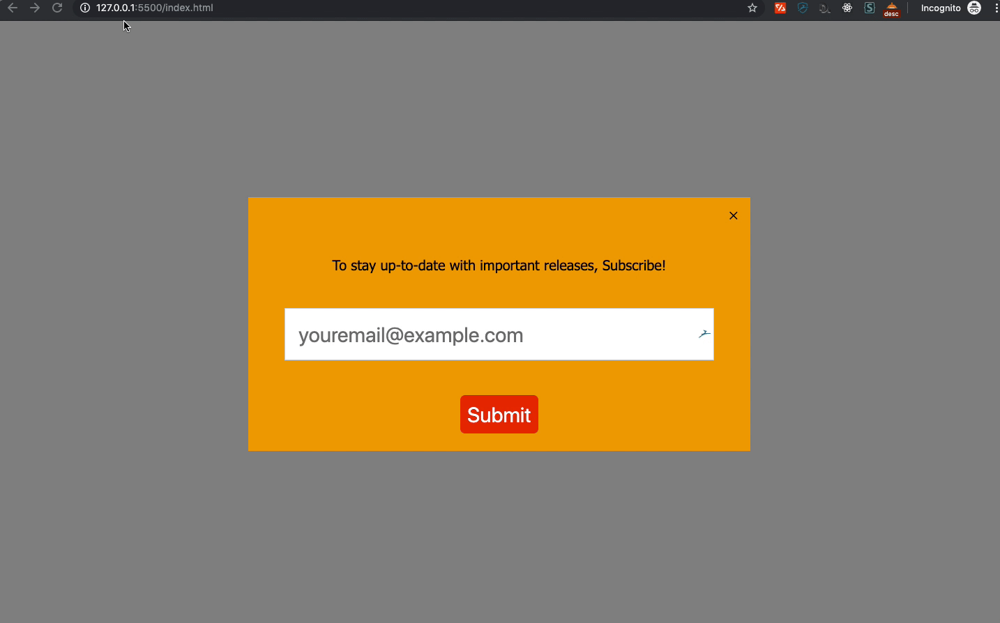

# Newsletter-Abonnement Overlay (Popup)

## Beschreibung

In dieser Übung erstellst du ein Popup, das den Benutzer auffordert, einen Newsletter zu abonnieren, wenn der Benutzer die Maus vertikal mehr als 100 Pixel vom oberen Rand des Viewports entfernt bewegt.

## Anweisungen

- Arbeite in der mitgelieferten Datei "index.html".
- Dein Formular (Popup) sollte ein Eingabefeld und einen Submit-Button haben.

## Aufgabe 1

- Erstelle ein Formular mit einem Eingabefeld für die E-Mail-Adresse und einer Schaltfläche zum Absenden.
- Beschrifte das Eingabefeld mit einem Hinweis darauf, dass der Nutzer den Newsletter abonniert hat.
- Standardmäßig sollte das Formular unsichtbar sein

### Aufgabe 2

- Schreibe eine Javascript-Funktion, die dafür sorgt, dass das Formular erscheint, wenn der Nutzer die Maus mehr als 100 Pixel vom oberen Rand des Ansichtsfensters entfernt bewegt

> Tipp: Du kannst die Eigenschaft `MouseEvent.clientY` verwenden, um den Abstand der Maus vom oberen Rand des Ansichtsfensters zu überprüfen.

**Optional:**

Style zu deinem Vergnügen :)

> Tipp: Schau dir die Darstellung unten an und beobachte das Mausverhalten, um eine Vorstellung davon zu bekommen, wie dein Ergebnis aussehen sollte.

